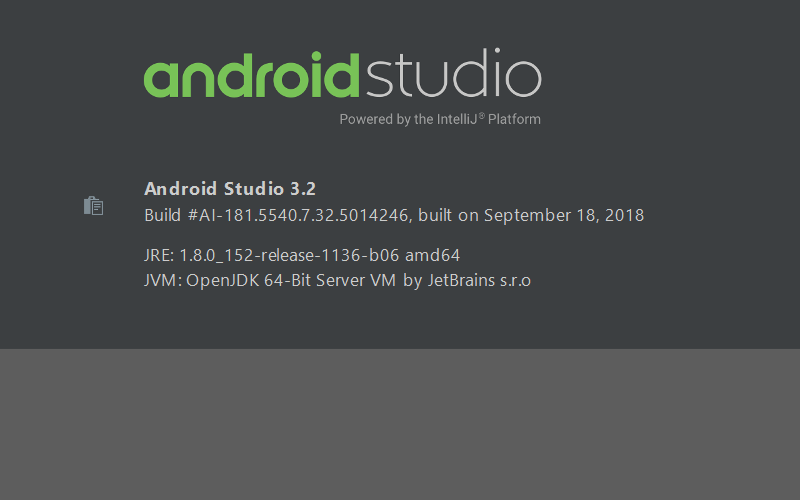
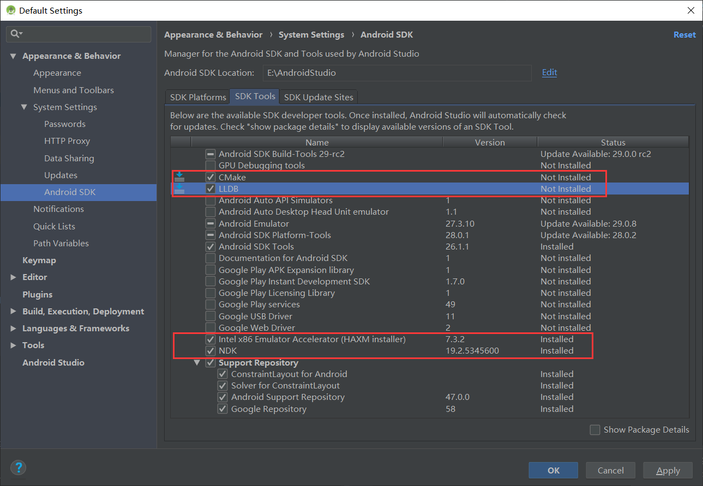

## jni demo
0. Android Studio 版本



1. jni 环境
>File-->Project Structure-->SDK Location



## 代码运行
2. 使新建的 activity 能够正常编译运行
> AndroidManifest.xml 添加
```
        <activity android:name=".MainActivity">
            <intent-filter>
                <action android:name="android.intent.action.MAIN"></action>
                <category android:name="android.intent.category.LAUNCHER"></category>
            </intent-filter>
        </activity>
```