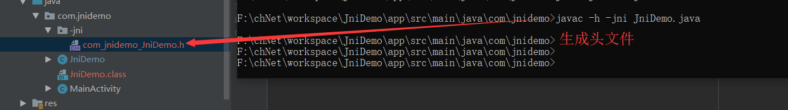

## jni 环境
0. Android Studio 版本


1. jni 环境
>File-->Project Structure-->SDK Location


2. 配置 gradle.properties
> android.useDeprecatedNdk=true

## 代码运行
0. 使新建的 activity 能够正常编译运行
> AndroidManifest.xml 添加
```
        <activity android:name=".MainActivity">
            <intent-filter>
                <action android:name="android.intent.action.MAIN"></action>
                <category android:name="android.intent.category.LAUNCHER"></category>
            </intent-filter>
        </activity>
```

## 生成使用 .h 文件



## 添加c文件


[遇到问题](./readme/error.md)
