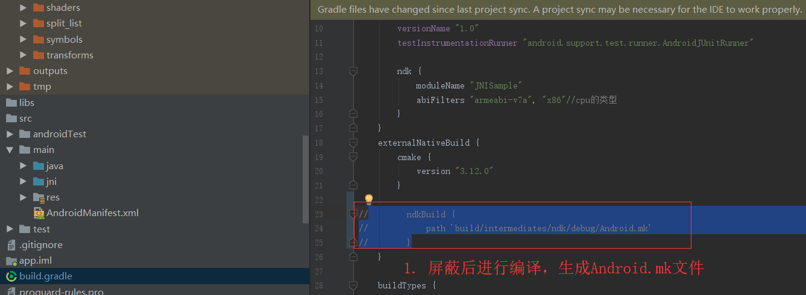
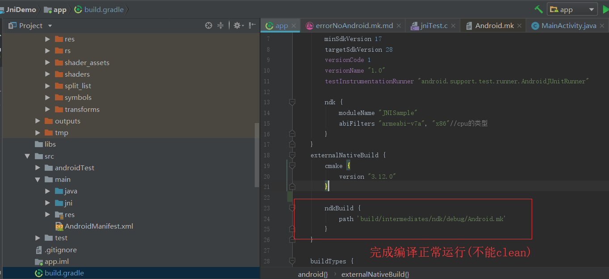

## 找不到 Android.mk 的错误
>**打印**
>> Gradle project ndkBuild.path is F:\chNet\workspace\JniDemo\app\build\intermediates\ndk\debug\Android.mk but that file doesn't exist

>**现象**
>> 文件夹 F:\chNet\workspace\JniDemo\app\build\intermediates\ 下无 ndk 目录

>> 使用git恢复到以往能够成功的状态也出现这个错误

>**解决办法**
1. 生成Android.mk文件
2. 完成编译正常运行(不能clean)

