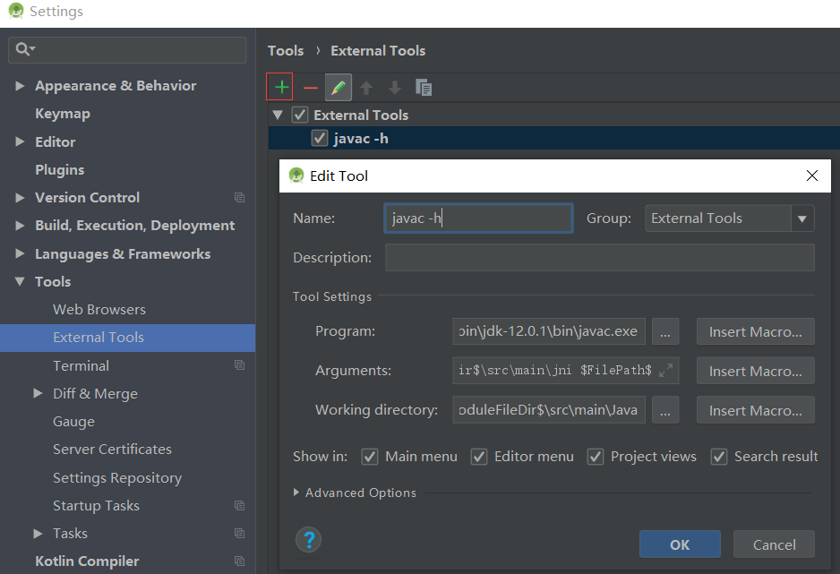
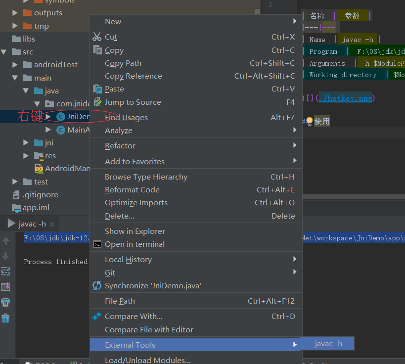

## 配置
File-->Settings-->Tools-->External Tools-->

| 名称  |  参数  |
|---|---|
| Name  | javac -h |
| Program  |  F:\OS\jdk\jdk-12.0.1_windows-x64_bin\jdk-12.0.1\bin\javac.exe (若配好了环境可以不加路径)|
| Arguments  | -h $ModuleFileDir$\src\main\jni $FilePath$  |
| Working directory  | $ModuleFileDir$\src\main\Java  |

## 使用
