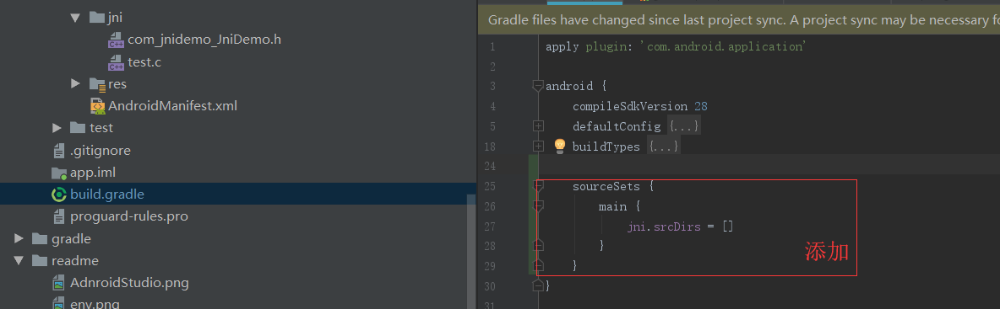
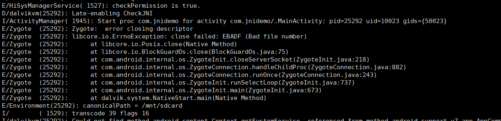

## 问题
```
Error: Your project contains C++ files but it is not using a supported native build system.
Consider using CMake or ndk-build integration. For more information, go to:
 https://d.android.com/r/studio-ui/add-native-code.html
Alternatively, you can use the experimental plugin:
 https://developer.android.com/r/tools/experimental-plugin.html
 
错误：您的项目包含C ++文件，但它没有使用受支持的本机构建系统。
考虑使用CMake或ndk-build集成。 有关更多信息，请访问：
 https://d.android.com/r/studio-ui/add-native-code.html
或者，您可以使用实验插件：
 https://developer.android.com/r/tools/experimental-plugin.html
 ```
 
## 尝试一
> gradle.properties 添加
>>android.useDeprecatedNdk=true
```
Error: Flag android.useDeprecatedNdk is no longer supported and will be removed in the next version of Android Studio.  Please switch to a supported build system.
Consider using CMake or ndk-build integration. For more information, go to:
 https://d.android.com/r/studio-ui/add-native-code.html#ndkCompile
 To get started, you can use the sample ndk-build script the Android
 plugin generated for you at:
 F:\chNet\workspace\JniDemo\app\build\intermediates\ndk\debug\Android.mk
Alternatively, you can use the experimental plugin:
 https://developer.android.com/r/tools/experimental-plugin.html
To continue using the deprecated NDK compile for another 60 days, set 
android.deprecatedNdkCompileLease=1557220411536 in gradle.properties

错误：不再支持标记android.useDeprecatedNdk，将在下一版本的Android Studio中删除。 请切换到支持的构建系统。
考虑使用CMake或ndk-build集成。 有关更多信息，请访问：
 https://d.android.com/r/studio-ui/add-native-code.html#ndkCompile
  要开始使用，您可以使用Android的示例ndk-build脚本
  为您生成的插件：
 F：\ chNet\工作区\ JniDemo\程序\建立\中间体\ NDK\调试\ Android.mk
或者，您可以使用实验插件：
 https://developer.android.com/r/tools/experimental-plugin.html
要继续使用已弃用的NDK编译另外60天，请设置
gradle.properties中的android.deprecatedNdkCompileLease = 1557220411536
```

## 尝试二
1. 添加

```
    sourceSets {
        main {
            jni.srcDirs = []
        }
    }
``` 
>不在本项目中生成c程序的so

报错：
